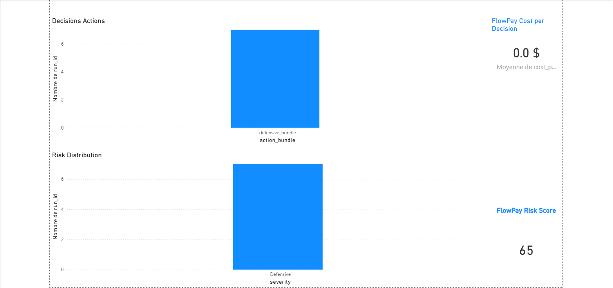

# FlowPay — Real-Time Cloud AI Financial Intelligence Platform

## Executive Summary



FlowPay is a production-style cloud-native AI financial intelligence platform designed to simulate real-time market risk detection, multi-agent orchestration, retrieval-augmented decision intelligence, and production-grade validation workflows.

The platform combines streaming ingestion, quantitative modeling, cloud orchestration, observability, validation pipelines, and AI-driven explanations into a unified architecture.

---


## Key Production Features

- Real-time streaming ingestion using Amazon Kinesis
- Multi-agent orchestration with AWS Step Functions
- Quantitative Market Risk Score (MRS) engine
- Retrieval-Augmented Generation (RAG) explanation layer
- Adversarial validation and replay testing
- Reliability-focused architecture with observability
- Infrastructure as Code using Terraform
- Analytics engineering with dbt
- CloudWatch metrics and SLO monitoring
- Production-style evidence generation pipeline

## Core Engineering Domains

- Real-time streaming systems
- Cloud-native AI infrastructure
- Event-driven architectures
- Multi-agent orchestration
- Retrieval-Augmented Generation (RAG)
- AI validation & evaluation
- Observability & monitoring
- Infrastructure as Code (Terraform)
- Analytics engineering (dbt)
- Production reliability engineering

---

## High-Level Architecture

[View Full Architecture Diagram](architecture/flowpay_architecture.md)

```text
Market Events
    ↓
AWS Kinesis Data Streams
    ↓
Kinesis Consumer / Lambda Processing
    ↓
Data Quality Layer
    ↓
Quantitative Risk Engine (MRS)
    ↓
Multi-Agent Decision Layer
    ↓
RAG Explanation Layer (Qdrant)
    ↓
S3 + Athena + Glue
    ↓
dbt Analytics Models
    ↓
CloudWatch Metrics + Validation Evidence
```


## AWS Cloud Stack

- Amazon Kinesis Data Streams
- AWS Lambda
- AWS Step Functions
- Amazon S3
- Amazon Athena
- AWS Glue Catalog
- Amazon CloudWatch
- Terraform Infrastructure as Code

---

## Production-Grade Validation

FlowPay includes a full validation and reliability framework:

- Adversarial replay testing
- Data quality validation
- Failure handling validation
- Latency & SLO validation
- Event replay systems
- Quantitative calibration
- RAG evaluation
- Streaming validation
- Global evidence generation

---
## Validation Results

| Validation Area | Result |
|---|---|
| Adversarial Testing | PASSED |
| Data Quality Validation | PASSED |
| Failure Handling Validation | PASSED |
| Streaming Validation | PASSED |
| RAG Evaluation | PASSED |
| SLO Validation (<5s) | PASSED |
| Global Validation Pass Rate | 100% |

---

## Performance Metrics

| Metric | Result |
|---|---|
| Average Latency | ~1.6s |
| P95 Latency | ~2.1s |
| SLO Target (<5s) | PASSED |
| Infrastructure Failures | 0 |

---

Observability & Reliability


CloudWatch metrics publishing
Validation evidence generation
Failure replay systems
Adversarial scenario testing
Decision quality evaluation
Reliability-oriented architecture
Infrastructure as Code

Infrastructure deployment is managed using Terraform.

Infrastructure components include:

Kinesis Data Streams
Lambda deployment
CloudWatch metrics
IAM policies
S3 storage
Athena integration
Analytics Engineering

FlowPay includes a dbt analytics layer with:

models
tests
snapshots
macros
lineage-ready transformations
Why This Project Matters

FlowPay demonstrates the intersection of:

AI Engineering
Cloud Data Engineering
Reliability Engineering
Streaming Architectures
LLMOps
Observability
Decision Intelligence Systems
Evidence & Validation

Validation evidence and evaluation summaries are available in the /evidence directory.

## Project Structure

```text
flowpay-real-time-ai-platform/
│
├── architecture/        # System architecture diagrams
├── data/                # Replay and validation datasets
├── docs/                # Documentation and README versions
├── evidence/            # Validation evidence and reports
├── flowpay_dbt/         # dbt analytics engineering layer
├── infra/               # Terraform infrastructure
├── screenshots/         # Dashboard and architecture screenshots
│
├── flowpay_quant_engine.py
├── flowpay_decision_agents.py
├── flowpay_validation_runner.py
├── flowpay_rag_with_quant.py
├── flowpay_observability.py
│
└── README.md


Author

Felix Brillant
AI / Cloud Data Engineering